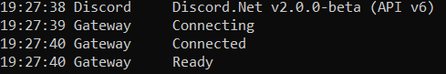

# Discord Bot

One bot to rule them all. A simple bot for your Discord server that keeps track of Overwatch and Fortnite stats. It also notifies the server when ever someone ranks up in Overwatch or has a win in Fortnite, no need to brag about it on Facebook.

## Getting Started

These instructions will get you a copy of the project up and running on your local machine for development and testing purposes. See deployment for notes on how to deploy the project on a live system.

### Prerequisites
* [Visual Studio](https://www.visualstudio.com/vs/whatsnew/) or something that can run a .Net Console Application
* [Discord](https://discordapp.com/)
* Friends to play with

### Installing

A step by step instruction

* You will need to create a bot on Discord first by following this [guide]( https://github.com/reactiflux/discord-irc/wiki/Creating-a-discord-bot-&-getting-a-token).

* Create an ``appsettings.json`` with the following format:
 ```
 {
 	"Token" : TOKEN_OF_DISCORD_BOT,
 	"ClientID: CLIENT_ID_OF_DISCORD_APP
 }
 ```
 
 

## Running the bot

If the bot is deployed successfully, you should see the following screen



### Overwatch commands

* Register yourself

```
Give an example
```

### And coding style tests

Explain what these tests test and why

```
Give an example
```

## Deployment

Add additional notes about how to deploy this on a live system

## Built With

* [Dropwizard](http://www.dropwizard.io/1.0.2/docs/) - The web framework used
* [Maven](https://maven.apache.org/) - Dependency Management
* [ROME](https://rometools.github.io/rome/) - Used to generate RSS Feeds

## Contributing

Please read [CONTRIBUTING.md](https://gist.github.com/PurpleBooth/b24679402957c63ec426) for details on our code of conduct, and the process for submitting pull requests to us.

## Versioning

We use [SemVer](http://semver.org/) for versioning. For the versions available, see the [tags on this repository](https://github.com/your/project/tags). 

## Authors

* **Billie Thompson** - *Initial work* - [PurpleBooth](https://github.com/PurpleBooth)

See also the list of [contributors](https://github.com/your/project/contributors) who participated in this project.

## License

This project is licensed under the MIT License - see the [LICENSE.md](LICENSE.md) file for details

## Acknowledgments

* Hat tip to anyone who's code was used
* Inspiration
* etc
