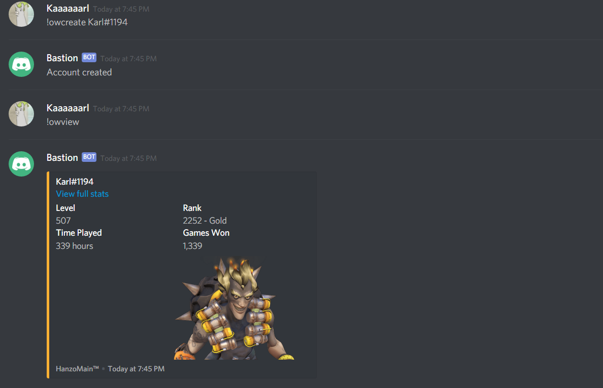

# Discord Bot

[](https://www.myget.org/feed/Packages/discord-net)   
One bot to rule them all. A simple bot for your Discord server that keeps track of Overwatch and Fortnite stats. It also notifies the server when ever someone ranks up in Overwatch or has a win in Fortnite, no need to brag about it on Facebook.

## Getting Started

These instructions will get you a copy of the project up and running on your local machine for development and testing purposes. See deployment for notes on how to deploy the project on a live system.

### Prerequisites
* [Visual Studio](https://www.visualstudio.com/vs/whatsnew/) or something that can run a .Net Console Application
* [Discord](https://discordapp.com/)
* Friends to play with

### Installing

A step by step instruction

* You will need to create a bot on Discord first by following this [guide]( https://github.com/reactiflux/discord-irc/wiki/Creating-a-discord-bot-&-getting-a-token).

* Create an ``appsettings.json`` with the following format:
 ```
 {
 	"Token" : TOKEN_OF_DISCORD_BOT,
 	"ClientID: CLIENT_ID_OF_DISCORD_APP
 }
 ```
 
 

## Running The Bot

If the bot is deployed successfully, you should see the following screen
  
For full list of commands, type ``!help``


### Examples

* Register yourself with an Overwatch profile

```
!owcreate Karl#1194
```
* View your Overwatch stats
```
!owview
```



## Built With

* [.NET Core 2.0](https://www.microsoft.com/net/download/windows) - Console Application
* [Discord.NET](https://github.com/RogueException/Discord.Net) - An unofficial .Net wrapper for the Discord API


## Release History
* **0.6.0** - 16/04/2018
	* **Added**:
		* Help command. Usage: ``!help``
* **0.5.0** - 16/04/2018
	* **Added**:
		* Overwatch commands: ``!owcreate``, ``!owview``
		* General command: ``!ping``
  


## Authors

* **Khoa Nguyen** - *Initial work* - [Karl0497](https://github.com/Karl0497)


## License

This project is licensed under the MIT License

